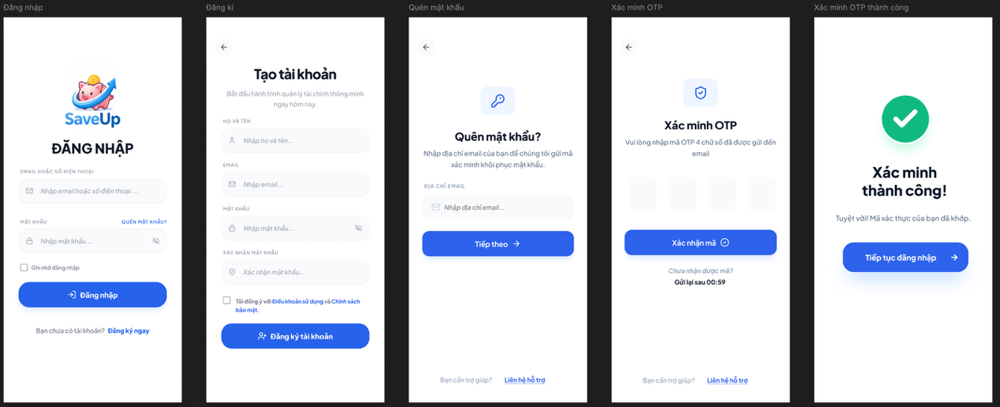
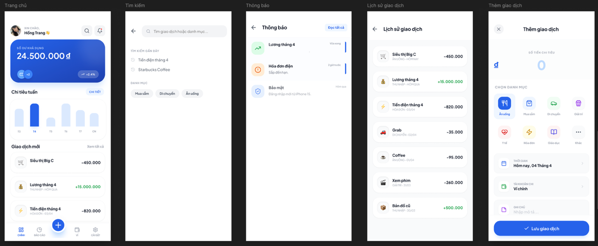
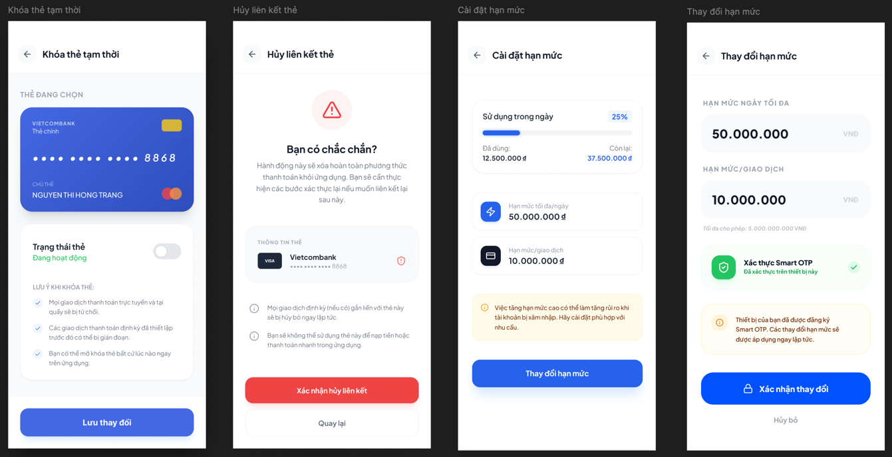
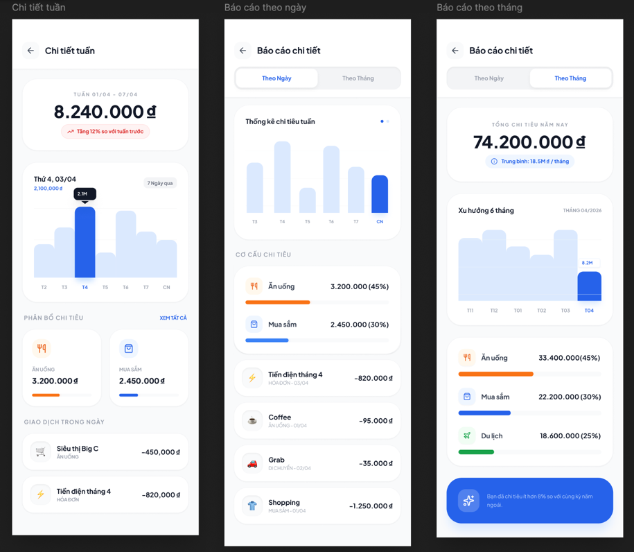
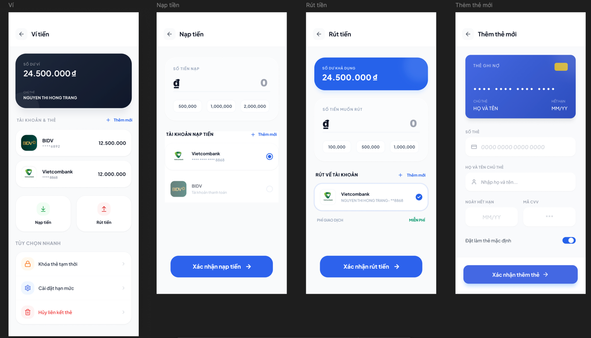
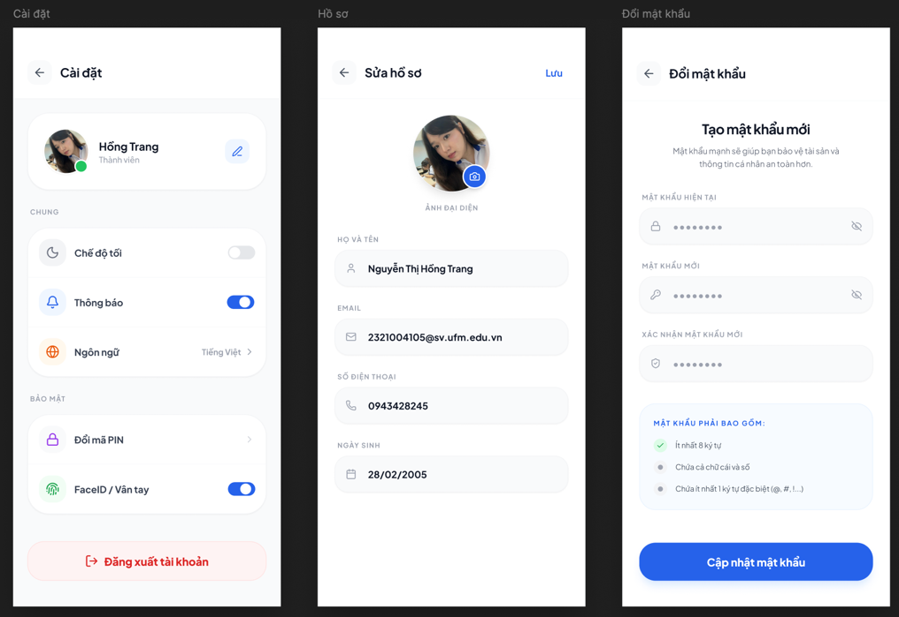

# Ứng dụng Quản lý Tài chính Cá nhân (UI/UX Design)

## Giới thiệu

Đây là đồ án môn **Thiết kế Giao diện và Trải nghiệm Người dùng (UI/UX)** với đề tài xây dựng ứng dụng **Quản lý Tài chính Cá nhân**.

Mục tiêu của dự án là thiết kế một ứng dụng di động giúp người dùng theo dõi thu nhập, chi tiêu, quản lý ví, xem báo cáo tài chính và hình thành thói quen quản lý tài chính hiệu quả thông qua giao diện trực quan, thân thiện và dễ sử dụng.

## Mục tiêu

- Thiết kế giao diện hiện đại, dễ sử dụng.
- Tối ưu trải nghiệm người dùng khi quản lý thu chi.
- Đơn giản hóa quy trình ghi nhận giao dịch.
- Trực quan hóa dữ liệu tài chính bằng biểu đồ và báo cáo.

## Chức năng chính

- Đăng ký, đăng nhập, quên mật khẩu
- Trang chủ tổng quan tài chính
- Thêm và quản lý giao dịch thu/chi
- Lịch sử giao dịch
- Báo cáo và thống kê
- Quản lý ví và tài khoản
- Thiết lập hạn mức chi tiêu
- Quản lý hồ sơ và cài đặt

## Công cụ sử dụng

- Figma
- Auto Layout
- Prototype
- Smart Animate

## Quy trình thực hiện

- Nghiên cứu người dùng (User Research)
- Khảo sát người dùng
- Persona
- User Journey
- User Flow
- Wireframe
- UI Design
- Prototype
- Usability Testing

## Giao diện

### Đăng nhập & Xác thực

---

### Trang chủ

---

### Quản lý giao dịch

---

### Báo cáo & Thống kê

---

### Quản lý ví

---

### Cài đặt tài khoản

---

## 🔗 Link dự án

**Figma**

https://www.figma.com/design/IaTaRNJXqsTWEH8CvtvanY

**Prototype Demo**
https://www.figma.com/proto/IaTaRNJXqsTWEH8CvtvanY/2321004105_Nguy%E1%BB%85n-Th%E1%BB%8B-H%E1%BB%93ng-Trang?node-id=12-1075&p=f&t=ndtjvo0dqmTW1ehK-0&scaling=scale-down&content-scaling=fixed&page-id=0%3A1&starting-point-node-id=12%3A1075
